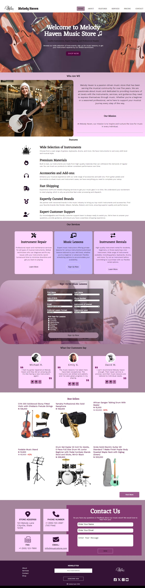

# Music-store-product-landing-page

This is a project was done in order to complete my free code camp Responsive design course 

## Table of contents

- [Overview](#overview)
  - [The challenge](#the-challenge)
  - [Screenshot](#screenshot)
  - [Links](#links)
- [My process](#my-process)
  - [Built with](#built-with)
  - [What I learned](#what-i-learned)
  - [Continued development](#continued-development)
- [Author](#author)
- [Acknowledgments](#acknowledgments)

## Overview

### The challenge

Users should be able to:

- View the optimal layout for the site depending on their device's screen size
- See hover states for all interactive elements on the page

There are two branches for this project, the freecodecamp branch is my submission to the Freecodecamp Responsive design course.

### Screenshot

### Links

- Solution URL: [solution](https://github.com/rh0se/Music-store-product-landing-page)
- Live Site URL: [live site](https://rh0se.github.io/Music-store-product-landing-page/)

## My process

### Built with

- Semantic HTML5 markup
- CSS custom properties
- Flexbox
- CSS Grid
- Desktop-first workflow
- [Canva](https://www.canva.com/) - For logo 
- [Font-AW](https://fontawesome.com/)- for font styles

### What I learned
  Responsive web design 

### Continued development
 I will try the mobile first workflow in my next project.

## Author

- github - [Rhose](https://github.com/rh0se)

- Twitter - [@NerdySimi](https://www.twitter.com/NerdySimi)

## Acknowledgments
Never thought i will complete this project, so I am proud I could finish.
